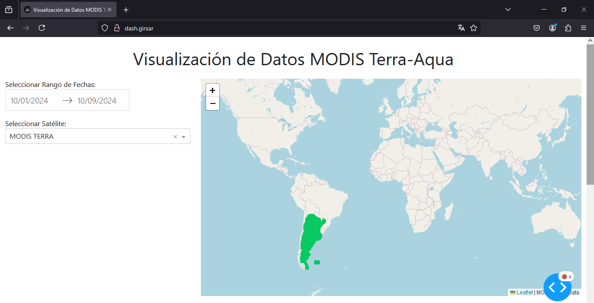
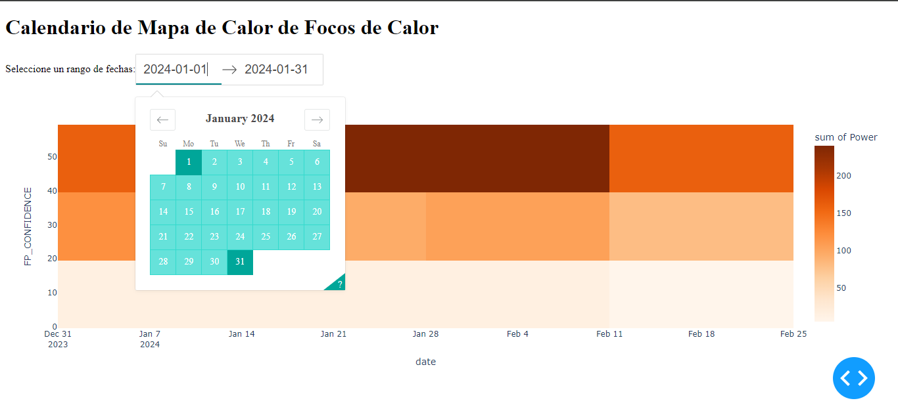

# Proyecto de Visualización de Datos MODIS Terra-Aqua
Este proyecto contiene scripts en Python y gráficos asociados para la visualización y análisis de datos de focos de calor obtenidos desde los satélites MODIS Terra y Aqua. A continuación, se describen los contenidos de cada archivo:

### Calendario_1.py
Este script contiene la configuración para generar un gráfico de calendario en el que se visualizan los focos de calor. Se utiliza el campo `FP_CONFIDENCE` de los datos de MODIS Terra y Aqua, y se muestran las fechas de interés.

### Calendario_2.py
Este script expande la funcionalidad del primero, agregando más opciones de visualización y mejorando la precisión en el análisis de los datos de los focos de calor. Se utiliza la librería `matplotlib` para generar gráficos de calor con mayor detalle.

### Consulta_2capasMODIS.py
Este script permite la consulta de servicios WMS/WFS para obtener datos de las capas MODIS Terra y Aqua desde GeoServer. Realiza peticiones a dos servicios WFS separados y procesa los datos para visualizarlos en un mapa.

## Imágenes

- 
- 

Estos gráficos ilustran los resultados obtenidos tras ejecutar los scripts.